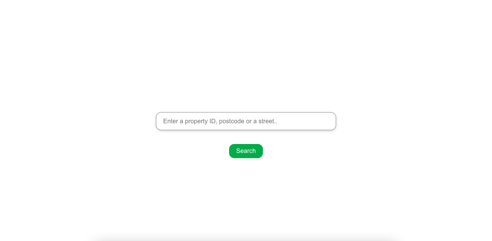
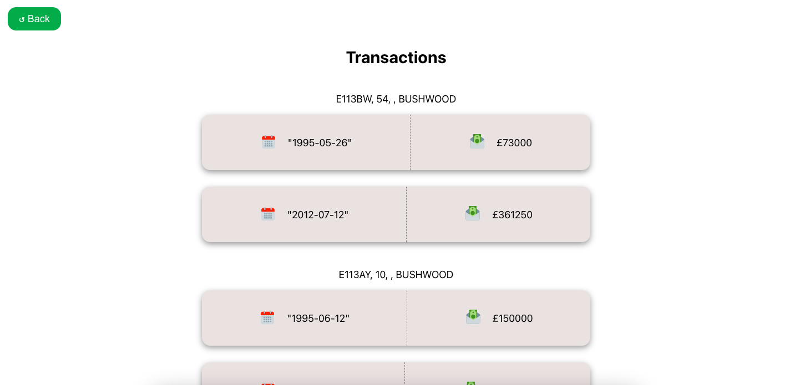

# Get Transactions App

This project was completed as part of GetAgent recruitment process.

## Install Dependencies

To Install the project dependencies, run the script setup.sh located in the root of the repository. Run using the below command.

### `./setup.sh`

 

## Setup

Navigate into both the frontend and api directories and run the below command in each.

### `npm run start`

 

## Example Screenshots

